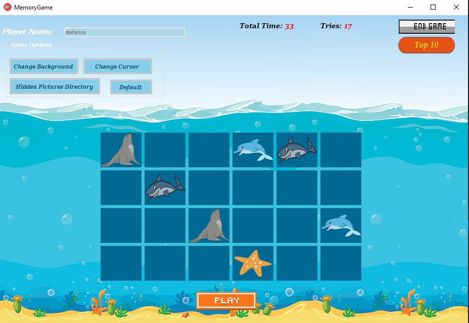
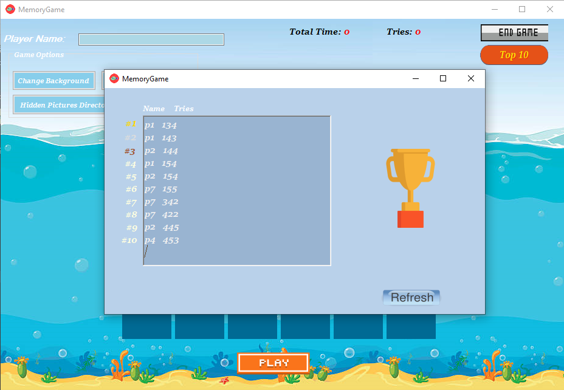

A Visual studio project (windows form application) for a memory game that count the tries and the time until every picture is matched.

There is also a simple leaderboard with the best 10 players

You can change the theme of the game (by changing the background of the form , changing the cursor icon while hovering the boxes , changing the hidden images) from inside the application

For the hidden images it has to be a directory that includes 12 images.

